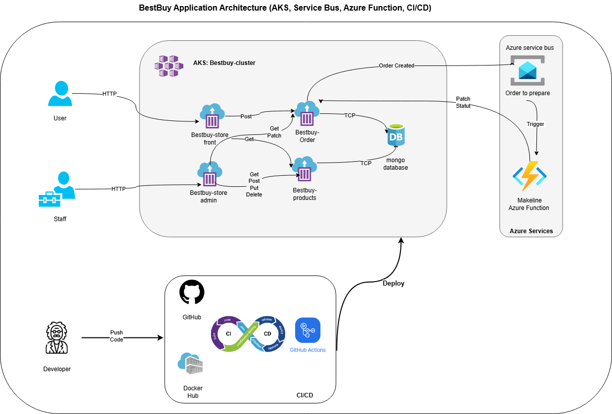

# BestBuy Cloud-Native Demo Application  
### (AKS, Azure Service Bus, Azure Function, CI/CD)

This project is a cloud-native demonstration of a simplified BestBuy-style e-commerce system.  
It was designed to show how microservices, Kubernetes, messaging, and serverless functions can work together to support a modern retail workflow.

---
## Demo Video Link

YouTube Link: https://youtu.be/UpOpCs_cA2w

## Architecture Diagram

---

## Brief Application Explanation

This application is a simplified cloud-native version of an online BestBuy store.  
It includes two user interfaces:

1. **Store-Front (Customer side)**  
   Customers can browse products, view details, add items to a cart, and place an order.  
   The goal is to provide a clean and fast shopping experience.

2. **Store-Admin (Staff side)**  
   Staff members can manage the product catalog by creating, updating, or deleting products.  
   This allows the business team to keep the store up to date without developer involvement.

When a customer places an order, the system saves it in MongoDB and sends an event to Azure Service Bus.  
An **Azure Function (Makeline)** automatically reviews the order total and updates the status:

- Orders **under 2000 CAD** are completed automatically.  
- Orders **over 2000 CAD** remain pending for manual human review.

This creates a simple but realistic workflow where routine orders are automated, while high-value orders receive additional control and verification.

1\. Prerequisites
-----------------

Before deploying the application, ensure the following items are ready:

- An Azure subscription\
- An Azure Kubernetes Service (AKS) cluster\
- kubectl installed and connected to your AKS cluster\
- Docker Hub account (for building and storing images)\
- Azure Service Bus namespace with a queue named "orders-to-prepare"\
- The Makeline Azure Function is already deployed and connected to the queue\
- All microservices pushed to GitHub with their CI/CD workflows enabled

The application uses the following containerized services:

-- Store-Front\
-- Store-Admin\
-- Product-Service\
-- Order-Service\
-- MongoDB (StatefulSet inside AKS)

* * * * *

2\. Connect kubectl to the AKS Cluster
--------------------------------------

Use the Azure CLI to configure kubectl:

az aks get-credentials --resource-group <RESOURCE_GROUP> --name <CLUSTER_NAME>

You should now be able to run:

kubectl get nodes

* * * * *

3\. Apply the Namespace, ConfigMap, and Secret
----------------------------------------------

The project includes configuration files inside the "DeploymentFiles" folder.

Step 1: Create the namespace and ConfigMap:

kubectl apply -f DeploymentFiles/config-maps.yaml

Step 2: Create the Kubernetes Secret that contains the Azure Service Bus connection string:

kubectl apply -f DeploymentFiles/secrets.yaml

Make sure that the value inside the secret matches the connection string from your Azure Service Bus namespace.

* * * * *

4\. Deploy All Microservices and MongoDB
----------------------------------------

Apply the main deployment file to create every workload inside AKS:

kubectl apply -f DeploymentFiles/aps-all-in-one.yaml

This file deploys:

- MongoDB StatefulSet and its service\
- Product-Service deployment and service\
- Order-Service deployment and service\
- Store-Front deployment and LoadBalancer\
- Store-Admin deployment and LoadBalancer

* * * * *

5\. Verify That All Pods Are Running
------------------------------------

Check the status of your deployments:

kubectl get pods -n bestbuy

You should see all services in "Running" state, including the MongoDB pod.

To check services and external IPs:

kubectl get svc -n bestbuy

The Store-Front and Store-Admin services will show an external IP (LoadBalancer).

Record these URLs:

- Store-Front URL → for customers\
- Store-Admin URL → for staff operations

* * * * *

6\. Configure the Makeline Azure Function
-----------------------------------------

The Makeline Azure Function must know how to contact the order-service inside AKS.

Set the following application settings in Azure (Function App → Configuration):

ORDER_API_BASE_URL = http://order-service:4001/api/orders

SERVICE_BUS_CONNECTION_STRING = <your connection string>

SERVICE_BUS_QUEUE_NAME = orders-to-prepare

Once saved, restart the Function to apply the changes.

* * * * *

7\. Test the End-to-End Flow
----------------------------

### Step 1: Customer places an order

Open the Store-Front external URL in a browser.\
Browse products, add items to the cart, and click "Place Order".

### Step 2: Order-Service saves the order

The order-service writes the new order into MongoDB and sends an event to Azure Service Bus.

### Step 3: Azure Function processes the order

Open the Function → Monitor → Logs.\
You should see:

"Processing order <id> with totalAmount = ..."

If the amount is below your threshold, the Function patches the order to "COMPLETED".\
If the amount is too high, the Function leaves it "PENDING".

### Step 4: Validate in the admin system or through API

Store-Admin UI can display the product list.\
You can also verify orders using:

kubectl port-forward svc/order-service 4001:4001 -n bestbuy\
curl http://localhost:4001/api/orders

* * * * *

8\. CI/CD Deployment (Automatic Updates)
----------------------------------------

Each microservice has a GitHub Actions workflow that handles:

1.  Building a Docker image

2.  Pushing the image to Docker Hub

3.  Updating the AKS deployment using:\
    kubectl set image ...

4.  Waiting for the rollout to complete

Required GitHub repository secrets:

- DOCKER_USERNAME\
- DOCKER_PASSWORD\
- KUBECONFIG_B64 (base64 version of your kubeconfig file)

Required GitHub variables:

- DOCKER_IMAGE_NAME\
- DEPLOYMENT_NAME\
- CONTAINER_NAME

To deploy a new version:

- Push code to the "main" branch\
- GitHub Actions automatically rebuilds and redeploys the service

**Links Table (GitHub Repositories + Docker Hub Images)**
=========================================================

* * * * *

**GitHub Repositories**
-----------------------

| Service | Repository URL |
| --- | --- |
| Store-Front | <https://github.com/Ahmedbooudouh/bestbuy-store-front-service.git> |
| Store-Admin | <https://github.com/Ahmedbooudouh/bestby-store-admin.git> |
| Order-Service | <https://github.com/Ahmedbooudouh/bestby-order-service.git> |
| Product-Service | <https://github.com/Ahmedbooudouh/bestbuy-product-service.git> |

* * * * *

**Docker Hub Images**
---------------------

| Service | Final Docker Hub Image URL |
| --- | --- |
| Store-Front | https://hub.docker.com/r/ahmedboudouh/bestbuy-store-front-f |
| Store-Admin | https://hub.docker.com/r/ahmedboudouh/bestbuy-store-admin-f |
| Order-Service | https://hub.docker.com/r/ahmedboudouh/bestbuy-order-service-f |
| Product-Service | https://hub.docker.com/r/ahmedboudouh/bestbuy-product-service-f |